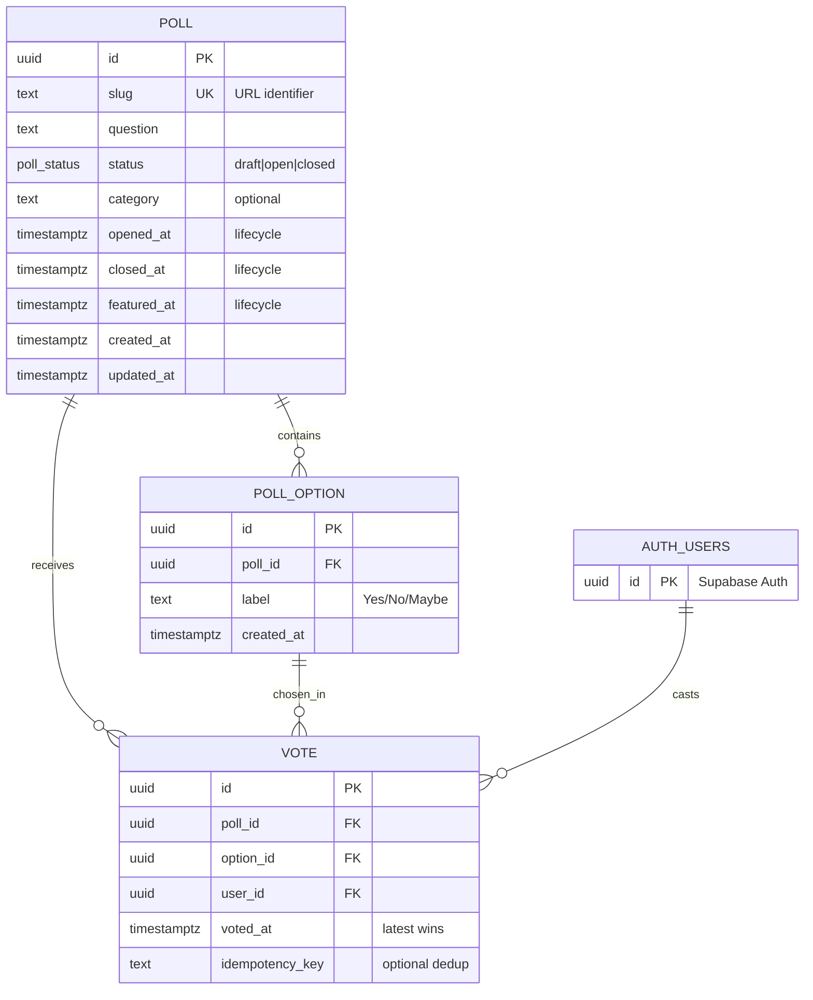

# Database Schema & Guidelines

## Overview

This project uses Supabase PostgreSQL with a simple directional sentiment polling schema. The database is designed for append-only vote logging with real-time tallying capabilities.

## Schema Visualization



## Core Tables

### `poll` - Poll Metadata

- **Purpose**: Top-level poll records with lifecycle management
- **Key Features**:
  - Human-readable `slug` for URLs (`/api/polls/:slug`)
  - Status-driven workflow (`draft` → `open` → `closed`)
  - Lifecycle timestamps for editorial control
- **Indexes**: Optimized for newest-first feed pagination

### `poll_option` - Answer Choices

- **Purpose**: Per-poll answer choices (e.g., "Yes", "No", "Maybe")
- **Key Features**:
  - Each poll owns its option rows (no sharing across polls)
  - Unique labels within same poll
  - Composite FK support for vote validation
- **Constraints**: Prevents duplicate labels per poll

### `vote` - Append-Only Vote Log

- **Purpose**: Immutable vote history with latest-wins semantics
- **Key Features**:
  - **Never updated** - new vote = new row
  - Latest `(voted_at, id)` per user determines current choice
  - User-scoped idempotency for client retry protection
  - Composite FK ensures vote belongs to correct poll
- **Indexes**: Optimized for real-time tallying queries

## Architectural Patterns

### Append-Only Voting

- **No UPDATE operations** on votes
- Vote changes insert new rows
- "Current vote per user" = latest timestamp + ID tie-breaker
- Preserves complete audit trail

### Composite Foreign Keys

- `vote(poll_id, option_id)` → `poll_option(poll_id, id)`
- **Prevents option mismatch**: Cannot vote for Option A in Poll B
- Database-level integrity protection

### Lifecycle Management

- Poll status drives API behavior (`open` = accepts votes)
- Editorial timestamps support CMS operations
- Status transitions controlled by domain logic

### User-Scoped Idempotency

- Optional `idempotency_key` prevents duplicate votes
- Scoped per user (same key can be reused across users)
- Partial unique index (ignores NULL keys)

## Performance Considerations

### Pagination Indexes

- `idx_poll_created_desc`: Keyset pagination for poll feed
- Compound indexes with tie-breakers for consistent ordering

### Vote Tallying Indexes

- `idx_vote_latest_per_user`: Fast "current vote per user" queries
- `idx_vote_poll`: Efficient vote aggregation per poll
- Supports real-time results calculation

### Referential Integrity

- All foreign keys use appropriate cascading rules
- `auth.users` cascade deletes remove user's votes
- Poll deletion cascades to options and votes

## TypeScript Types

**Generated Types Location**: `src/app/(adapters)/(out)/supabase/types.ts`

This file contains auto-generated TypeScript definitions for all database tables and is the **authoritative reference** for schema structure. It scales automatically with database changes and should be used instead of manually maintaining type definitions.

**Usage Pattern**:

```typescript
import type {Database} from "@/app/(adapters)/(out)/supabase/types"

type Poll = Database["public"]["Tables"]["poll"]["Row"]
type Vote = Database["public"]["Tables"]["vote"]["Insert"]
```

## Migration Management

### File Location

- **Migrations**: `supabase/migrations/`
- **Current Schema**: `20250823171007_create_mvp_db.sql`

## Security Model

### Row Level Security (RLS)

- All tables have RLS enabled
- No default policies (deny-all by default)
- Access controlled through Supabase service role in adapters
