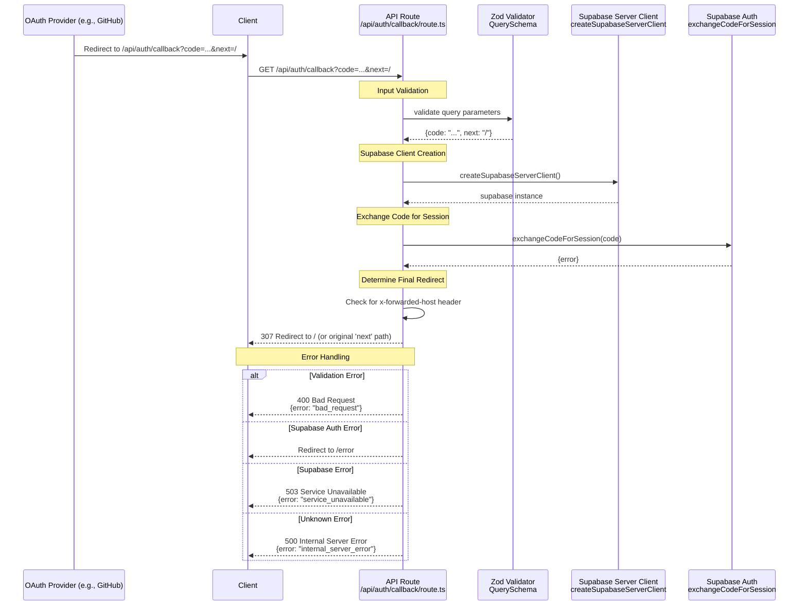

# Auth Callback Sequence Diagram

This sequence diagram shows the data flow for the `GET /api/auth/callback` endpoint. This route handles the callback from an OAuth provider after a user has successfully authenticated.

## Key Components

### 1. Input Validation

- **Zod Schema**: Validates the `code` (required) and `next` (optional) query parameters.
- **Error Handling**: Returns 400 on validation failure.

### 2. Code Exchange

- The route receives a one-time authorization `code` from the OAuth provider.
- It calls `exchangeCodeForSession` to trade this code for a valid user session with Supabase.

### 3. Session Creation

- On successful code exchange, Supabase Auth creates a session for the user and automatically handles setting the session cookie on the response.

### 4. Redirection

- The user is redirected back to the application, typically to the page they were trying to access before authentication began (the `next` path).
- The logic correctly handles `x-forwarded-host` headers to ensure proper redirection in production environments behind a load balancer.
