# Cast Vote Sequence Diagram

This sequence diagram shows the data flow for the `POST /api/polls/:slug/votes` endpoint, which implements the cast vote use case with validation and idempotency.

```mermaid
sequenceDiagram
    participant Client
    participant Route as API Route<br/>/api/polls/[slug]/votes/route.ts
    participant ZodParams as Zod Validator<br/>ParamsSchema
    participant ZodBody as Zod Validator<br/>BodySchema
    participant Auth as Authentication<br/>Supabase Auth
    participant SupabasePollsAdapter as Supabase Polls Adapter<br/>createPollsSource
    participant SupabaseVotesAdapter as Supabase Votes Adapter<br/>createVotesSource
    participant UseCase as Use Case<br/>castVote
    participant PollsSource as PollsSource<br/>Port Interface
    participant VotesSource as VotesSource<br/>Port Interface

    Client->>Route: POST /api/polls/poll-123/votes<br/>{optionId: "option-a", idempotencyKey: "key-123"}

    Note over Route: Input Validation
    Route->>ZodParams: validate slug parameter
    ZodParams-->>Route: {slug: "poll-123"}
    Route->>ZodBody: validate request body
    ZodBody-->>Route: {optionId: "option-a", idempotencyKey: "key-123"}

    Note over Route: Authentication
    Route->>Auth: getUser()
    Auth-->>Route: userId | null

    alt Not Authenticated
        Route-->>Client: 401 Unauthorized<br/>{error: "unauthorized"}
    else Authenticated
        Note over Route: Adapter Creation
        Route->>SupabasePollsAdapter: createPollsSource(client)
        Route->>SupabaseVotesAdapter: createVotesSource(client)
        SupabasePollsAdapter-->>Route: PollsSource implementation
        SupabaseVotesAdapter-->>Route: VotesSource implementation

        Note over Route: Domain Logic Execution
        Route->>UseCase: castVote({polls, votes, input})

        Note over UseCase: Poll Validation
        UseCase->>PollsSource: findBySlug("poll-123")

        PollsSource->>SupabasePollsAdapter: findBySlug("poll-123")
        Note over SupabasePollsAdapter: SELECT id, status<br/>FROM poll<br/>WHERE slug = 'poll-123'<br/>LIMIT 1
        SupabasePollsAdapter-->>PollsSource: {pollId, status} | null

        PollsSource-->>UseCase: pollSummary

        alt Poll Not Found
            UseCase->>UseCase: throw new Error("not_found")
            UseCase-->>Route: Error: "not_found"
            Route-->>Client: 404 Not Found<br/>{error: "not_found"}
        else Poll Closed
            UseCase->>UseCase: if status !== "open"<br/>throw new Error("poll_closed")
            UseCase-->>Route: Error: "poll_closed"
            Route-->>Client: 409 Conflict<br/>{error: "poll_closed"}
        else Poll Open
            Note over UseCase: Option Validation
            UseCase->>PollsSource: listOptions(pollId)

            PollsSource->>SupabasePollsAdapter: listOptions(pollId)
            Note over SupabasePollsAdapter: SELECT optionId<br/>FROM poll_option<br/>WHERE pollId = pollId
            SupabasePollsAdapter-->>PollsSource: Array<{optionId}>

            PollsSource-->>UseCase: options

            alt Option Mismatch
                UseCase->>UseCase: if !options.includes(optionId)<br/>throw new Error("option_mismatch")
                UseCase-->>Route: Error: "option_mismatch"
                Route-->>Client: 422 Unprocessable Entity<br/>{error: "option_mismatch"}
            else Valid Option
                Note over UseCase: Idempotency Check
                UseCase->>VotesSource: wasUsed(userId, idempotencyKey)

                VotesSource->>SupabaseVotesAdapter: wasUsed(userId, idempotencyKey)
                Note over SupabaseVotesAdapter: SELECT COUNT(*)<br/>FROM vote<br/>WHERE userId = userId<br/>AND idempotencyKey = key
                SupabaseVotesAdapter-->>VotesSource: boolean

                VotesSource-->>UseCase: used

                alt Already Used
                    UseCase->>UseCase: return (no-op)
                    UseCase-->>Route: void (idempotent)
                else Not Used
                    Note over UseCase: Vote Storage
                    UseCase->>VotesSource: append({pollId, optionId, userId, idempotencyKey})

                    VotesSource->>SupabaseVotesAdapter: append(voteData)
                    Note over SupabaseVotesAdapter: INSERT INTO vote<br/>(pollId, optionId, userId, idempotencyKey)<br/>VALUES (...)
                    SupabaseVotesAdapter-->>VotesSource: void

                    VotesSource-->>UseCase: void
                    UseCase-->>Route: void
                end

                Note over Route: Response Formatting
                Route->>Route: console.info("🎉")
                Route-->>Client: 204 No Content
            end
        end
    end

    Note over Route,Client: Error Handling
    alt Validation Error
        Route-->>Client: 400 Bad Request<br/>{error: "bad_request", message}
    else Authentication Error
        Route-->>Client: 401 Unauthorized<br/>{error: "unauthorized"}
    else Poll Not Found
        Route-->>Client: 404 Not Found<br/>{error: "not_found"}
    else Poll Closed
        Route-->>Client: 409 Conflict<br/>{error: "poll_closed"}
    else Option Mismatch
        Route-->>Client: 422 Unprocessable Entity<br/>{error: "option_mismatch"}
    else Supabase Error
        Route-->>Client: 503 Service Unavailable<br/>{error: "service_unavailable"}
    else Unknown Error
        Route-->>Client: 500 Internal Server Error<br/>{error: "internal_server_error"}
    end
```

## Key Components

### 1. Input Validation

- **Params Schema**: Validates `slug` parameter as non-empty string
- **Body Schema**: Validates `optionId` (required) and optional `idempotencyKey` (1-128 chars)
- **Error Handling**: Returns 400 with validation details on failure

### 2. Authentication

- **Production**: Uses Supabase authentication to get authenticated user
- **Authorization**: Returns 401 if no valid user found

### 3. Adapter Selection

- **Production**: Creates separate Supabase adapters for polls and votes
- **Port Pattern**: Both implementations provide `PollsSource` and `VotesSource` interfaces

### 4. Domain Logic (Use Case)

#### Poll Validation

- **Poll Lookup**: Finds poll by slug to verify existence
- **Status Check**: Ensures poll is in "open" status for voting
- **Error Handling**: Throws semantic errors for not found or closed polls

#### Option Validation

- **Option Lookup**: Fetches valid options for the poll
- **Membership Check**: Verifies the provided optionId belongs to the poll
- **Error Handling**: Throws "option_mismatch" for invalid options

#### Idempotency Protection

- **Key Check**: If idempotencyKey provided, checks if already used
- **No-op Return**: Returns early if key was previously used (idempotent)
- **Duplicate Prevention**: Prevents duplicate votes from same user action

#### Vote Storage

- **Append-only**: Stores vote in append-only log with metadata
- **Atomic Operation**: Single database insert with all vote data
- **Success Response**: Returns 204 No Content on successful vote cast

### 5. Response Format

Returns `204 No Content` with no response body on successful vote casting. The operation is idempotent when using `idempotencyKey`.

### 6. Data Sources (Supabase Adapters)

- **Polls Adapter**: Handles poll metadata and options queries
- **Votes Adapter**: Handles vote storage and idempotency checks
- **Transactional Safety**: Each operation uses appropriate database constraints
- **Error Mapping**: Database errors mapped to semantic domain errors

## Architectural Patterns

- **Hexagonal Architecture**: Clear separation between domain and infrastructure
- **Multiple Port Pattern**: Uses both `PollsSource` and `VotesSource` ports
- **Dependency Injection**: Use case receives both adapters through dependency injection
- **Domain Validation**: Multi-step validation (poll → status → option → idempotency)
- **Error Mapping**: Domain errors mapped to appropriate HTTP status codes
- **Idempotency**: Prevents duplicate operations through client-provided keys
- **Append-only Storage**: Vote history preserved for audit and recounting
