# Get Personalized Poll Feed Sequence Diagram

This sequence diagram shows the data flow for the `GET /api/polls/feed/personalized` endpoint, which implements the personalized poll feed use case with pagination support and user vote personalization.

```mermaid
sequenceDiagram
    participant Client
    participant Route as API Route<br/>/api/polls/feed/personalized/route.ts
    participant Zod as Zod Validator<br/>QuerySchema
    participant Auth as Authentication<br/>Supabase Auth
    participant SupabasePollFeedAdapter as Supabase PollFeed Adapter<br/>createPollFeedSource
    participant SupabaseVotesAdapter as Supabase Votes Adapter<br/>createVotesSource
    participant UseCase as Use Case<br/>getPersonalizedPollFeed
    participant PollFeedSource as PollFeedSource<br/>Port Interface
    participant VotesSource as VotesSource<br/>Port Interface

    Client->>Route: GET /api/polls/feed/personalized?limit=20&cursor=2025-01-15T10:00:00Z&quorum=100

    Note over Route: Input Validation
    Route->>Zod: validate query parameters
    Zod-->>Route: {limit: 20, cursor: "2025-01-15T10:00:00Z", quorum: 100}

    Note over Route: Authentication
    Route->>Auth: getUser()
    Auth-->>Route: userId | null

    alt Not Authenticated
        Route-->>Client: 401 Unauthorized<br/>{error: "unauthorized"}
    else Authenticated
        Note over Route: Adapter Creation
        Route->>SupabasePollFeedAdapter: createPollFeedSource(client)
        Route->>SupabaseVotesAdapter: createVotesSource(client)
        SupabasePollFeedAdapter-->>Route: PollFeedSource implementation
        SupabaseVotesAdapter-->>Route: VotesSource implementation

        Note over Route: Domain Logic Execution
        Route->>UseCase: getPersonalizedPollFeed({pollFeed, votes, input})

        Note over UseCase: Pagination Logic
        UseCase->>UseCase: pageSize = Math.min(Math.max(limit ?? 20, 1), 50)
        UseCase->>UseCase: quorumThreshold = quorum ?? 100
        UseCase->>PollFeedSource: page({limit: pageSize + 1, cursor, quorum})

        PollFeedSource->>SupabasePollFeedAdapter: page({limit: 21, cursor, quorum})
        SupabasePollFeedAdapter-->>PollFeedSource: Array<PollFeedPageItem>

        PollFeedSource-->>UseCase: rows (21 items max)

        Note over UseCase: Cursor Calculation
        UseCase->>UseCase: hasMore = rows.length > pageSize
        UseCase->>UseCase: items = hasMore ? rows.slice(0, pageSize) : rows
        UseCase->>UseCase: nextCursor = hasMore ? items[last].openedAt : undefined

        Note over UseCase: Personalization Logic
        UseCase->>UseCase: pollIds = items.map(i => i.pollId)
        UseCase->>VotesSource: currentByUserInPolls(pollIds, userId)

        VotesSource->>SupabaseVotesAdapter: currentByUserInPolls(pollIds, userId)
        Note over SupabaseVotesAdapter: Latest-wins query:<br/>ORDER BY voted_at DESC, id DESC
        SupabaseVotesAdapter-->>VotesSource: Array<{pollId, optionId}>

        VotesSource-->>UseCase: current votes per poll

        Note over UseCase: Enrichment Mapping
        UseCase->>UseCase: currentByPoll = Map<pollId, optionId>
        UseCase->>UseCase: personalizedItems = items.map(item => ({...item, current: currentByPoll.get(item.pollId) ?? null}))

        UseCase-->>Route: {items: PollPersonalizedPageItem[], nextCursor?: string}

        Note over Route: Response Formatting
        Route->>Route: console.info("🎉")
        Route-->>Client: 200 OK<br/>{items, nextCursor}<br/>Cache-Control: no-store
    end

    Note over Route,Client: Error Handling
    alt Validation Error
        Route-->>Client: 400 Bad Request<br/>{error: "bad_request", message}
    else Authentication Error
        Route-->>Client: 401 Unauthorized<br/>{error: "unauthorized"}
    else Supabase Error
        Route-->>Client: 503 Service Unavailable<br/>{error: "service_unavailable"}
    else Unknown Error
        Route-->>Client: 500 Internal Server Error<br/>{error: "internal_server_error"}
    end
```

## Key Components

### 1. Input Validation

- **Zod Schema**: Validates `limit` (1-50, optional), ISO `cursor` with timezone, and optional `quorum`
- **Error Handling**: Returns 400 with validation details on failure

### 2. Authentication

- **Required Authentication**: Uses Supabase auth to get authenticated user
- **Authorization**: Returns 401 if no valid user session found
- **User Context**: Extracts `userId` for personalization

### 3. Adapter Selection

- **Production**: Creates separate Supabase adapters for poll feed and votes
- **Port Pattern**: Adapters implement `PollFeedSource` and `VotesSource` interfaces

### 4. Domain Logic (Use Case)

#### Pagination & Quorum Logic

- **Limit Enforcement**: Normalizes and caps page size (min 1, max 50, default 20)
- **Quorum Threshold**: Applies default quorum for "warming up" status calculation
- **Pagination**: Requests `limit + 1` to detect if more pages exist
- **Cursor Generation**: Uses last item's `openedAt` as next page cursor

#### Personalization Logic

- **Vote Extraction**: Extracts `pollIds` from feed items for batch vote lookup
- **Current Votes**: Queries user's latest vote per poll using latest-wins semantics
- **Enrichment Mapping**: Adds `current` field to each item (user's optionId or null)
- **Map Optimization**: Uses `Map<pollId, optionId>` for O(1) lookup during enrichment

### 5. Data Sources (Supabase Adapters)

- **Poll Feed Adapter**: Handles poll feed pagination with quorum-aware RPC
- **Votes Adapter**: Handles user vote queries with latest-wins logic
- **SQL Ordering**: `ORDER BY voted_at DESC, id DESC` for consistent latest-wins
- **Error Mapping**: Supabase errors → domain errors

### 6. Response Format

Returns personalized feed data with `items` array containing `PollPersonalizedPageItem` (extends `PollFeedPageItem` with `current: string | null`) and optional `nextCursor`. See [`PollPersonalizedPageItem`](../../../src/app/_domain/use-cases/polls/dto/poll.ts) for complete response structure.

## Architectural Patterns

- **Hexagonal Architecture**: Clear separation between domain and infrastructure
- **Multiple Port Pattern**: Uses both `PollFeedSource` and `VotesSource` ports
- **Dependency Injection**: Use case receives both adapters through dependency injection
- **Authentication Required**: Enforces user authentication for personalization
- **Batch Optimization**: Single query to fetch user votes for all polls in feed
- **Latest-Wins Semantics**: User's most recent vote per poll determines `current` value
- **Error Mapping**: Domain errors mapped to appropriate HTTP status codes
