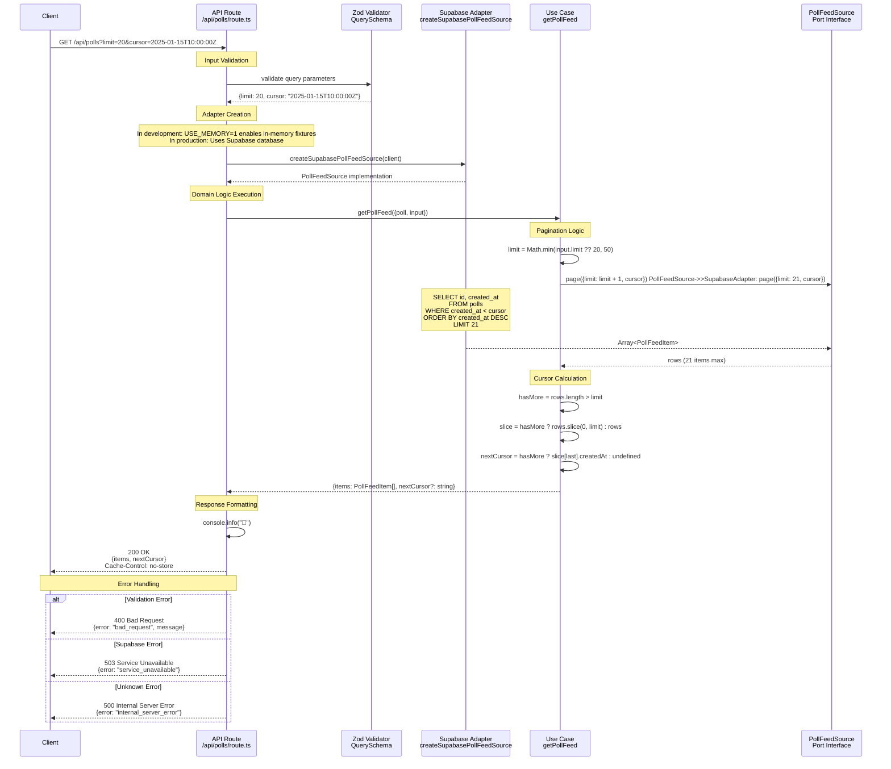

# Get Poll Feed Sequence Diagram

This sequence diagram shows the data flow for the `GET /api/polls` endpoint, which implements the poll feed use case with pagination support.



## Key Components

### 1. Input Validation

- **Zod Schema**: Validates `limit` (1-50, default 20) and optional ISO `cursor`
- **Error Handling**: Returns 400 with validation details on failure

### 2. Adapter Selection

- **Development Mode**: `USE_MEMORY=1` switches to in-memory fixtures for testing
- **Production**: Uses Supabase database with real-time data
- **Port Pattern**: Both adapters implement `PollFeedSource` interface

### 3. Domain Logic (Use Case)

- **Limit Enforcement**: Caps at 50 items maximum
- **Pagination**: Requests `limit + 1` to detect if more pages exist
- **Cursor Generation**: Uses last item's `createdAt` as next page cursor

### 4. Data Source (Supabase Adapter)

- **SQL Query**: `ORDER BY created_at DESC` for newest-first ordering
- **Keyset Pagination**: `WHERE created_at < cursor` prevents duplicates
- **Error Mapping**: Supabase errors → domain errors

### 5. Response Format

```json
{
  "items": [
    {
      "pollId": "poll-123",
      "createdAt": "2025-01-15T10:00:00Z"
    }
  ],
  "nextCursor": "2025-01-14T15:30:00Z"
}
```

## Architectural Patterns

- **Hexagonal Architecture**: Clear separation between domain and infrastructure
- **Port/Adapter Pattern**: `PollFeedSource` port with multiple implementations
- **Dependency Injection**: Use case receives adapter through dependency injection
- **Error Mapping**: Domain errors mapped to appropriate HTTP status codes
- **Environment Switching**: Seamless testing/production mode switching
