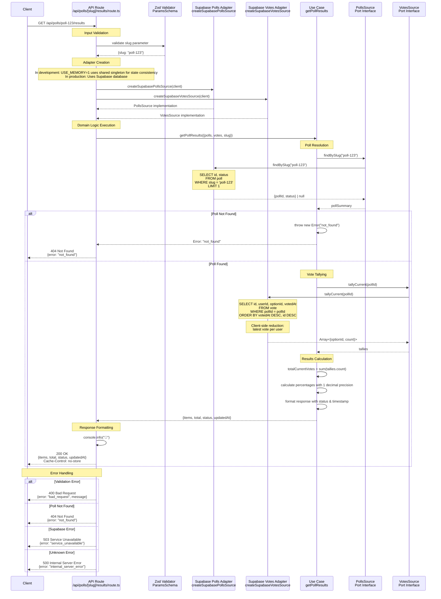

# Get Poll Results Sequence Diagram

This sequence diagram shows the data flow for the `GET /api/polls/:slug/results` endpoint, which implements the poll results use case with vote tallying.



## Key Components

### 1. Input Validation

- **Zod Schema**: Validates `slug` parameter as non-empty string
- **Error Handling**: Returns 400 with validation details on failure

### 2. Adapter Selection

- **Development Mode**: `USE_MEMORY=1` uses shared singleton for state consistency
- **Production**: Creates separate Supabase adapters for polls and votes
- **Port Pattern**: Both implementations provide `PollsSource` and `VotesSource` interfaces

### 3. Domain Logic (Use Case)

#### Poll Resolution

- **Poll Lookup**: Finds poll by slug to get `pollId` and `status`
- **Not Found Handling**: Throws semantic "not_found" error if poll doesn't exist

#### Vote Tallying

- **Latest Vote Logic**: For each user, only their most recent vote counts
- **Percentage Calculation**: Computed to 1 decimal place with divide-by-zero protection
- **Real-time Results**: Always calculated fresh from current vote state

### 4. Data Sources (Supabase Adapters)

- **Polls Adapter**: Handles poll metadata queries (`poll` table)
- **Votes Adapter**: Handles vote queries and tallying (`vote` table)
- **Client-side Reduction**: Fetches all votes for poll, reduces latest per user
- **SQL Ordering**: `ORDER BY votedAt DESC, id DESC` for consistent results

### 5. Response Format

```json
{
  "items": [
    {
      "optionId": "option-a",
      "count": 15,
      "pct": 62.5
    },
    {
      "optionId": "option-b",
      "count": 9,
      "pct": 37.5
    }
  ],
  "total": 24,
  "status": "open",
  "updatedAt": "2025-08-23T10:30:00.000Z"
}
```

## Architectural Patterns

- **Hexagonal Architecture**: Clear separation between domain and infrastructure
- **Multiple Port Pattern**: Uses both `PollsSource` and `VotesSource` ports
- **Dependency Injection**: Use case receives both adapters through dependency injection
- **Error Mapping**: Domain errors mapped to appropriate HTTP status codes
- **State Consistency**: Memory source singleton ensures votes persist across routes
- **Real-time Calculation**: Results computed on-demand from current vote state
