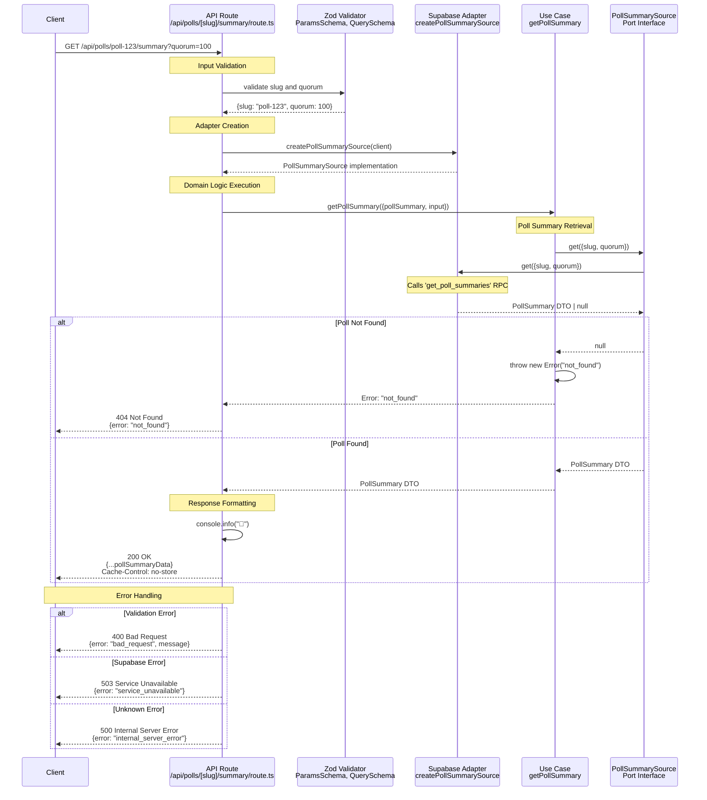

# Get Poll Summary Sequence Diagram

This sequence diagram shows the data flow for the `GET /api/polls/:slug/summary` endpoint, which implements the poll summary use case.

## Key Components

### 1. Input Validation

- **Zod Schemas**: Validates `slug` (required string) and optional `quorum` (number).
- **Error Handling**: Returns 400 with validation details on failure.

### 2. Adapter Selection

- **Production**: Uses Supabase database with a dedicated `PollSummarySource`.
- **Port Pattern**: Adapter implements the `PollSummarySource` interface.

### 3. Domain Logic (Use Case)

- **Data Fetching**: Directly calls the `get` method on the `PollSummarySource`.
- **Error Handling**: Throws a semantic "not_found" error if the summary is not returned.

### 4. Data Sources (Supabase Adapter)

- **Stored Procedure**: Calls the `get_poll_summaries` RPC in Supabase.
- **Parameters**: Passes `slug` and a default `quorum` to the stored procedure.
- **Error Mapping**: Supabase errors are mapped to domain errors.

### 5. Response Format

Returns the poll summary data directly from the use case. See `PollSummary` DTO for the complete response structure.

## Architectural Patterns

- **Hexagonal Architecture**: Clear separation between domain and infrastructure.
- **Port/Adapter Pattern**: `PollSummarySource` port with a Supabase implementation.
- **Dependency Injection**: Use case receives the adapter through dependency injection.
- **Database Logic**: Complex query logic is encapsulated in a database stored procedure (`RPC`).
- **Error Mapping**: Domain errors are mapped to appropriate HTTP status codes.
