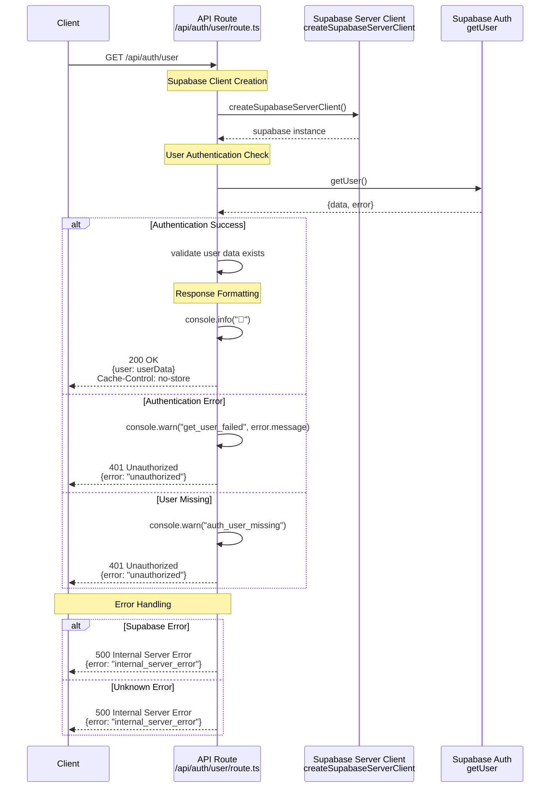

# Get User Sequence Diagram

This sequence diagram shows the data flow for the `GET /api/auth/user` endpoint, which retrieves the current authenticated user's information.

## Key Components

### 1. Supabase Client Creation

- **Server Client**: Creates a server-side Supabase client that has access to the current session cookies.
- **Session Context**: The client automatically includes the user's authentication session from the request.

### 2. User Authentication Check

- **`getUser()`**: Calls Supabase Auth to retrieve the current authenticated user from the session.
- **Session Validation**: Supabase validates the session token and returns user data or an error.

### 3. Response Handling

#### Success Path

- **User Data**: Returns sanitized user information (id, email, timestamps)
- **Cache Headers**: Sets `Cache-Control: no-store` to prevent caching of user data
- **Logging**: Success logged with emoji for quick visual parsing

#### Error Paths

- **Auth Failure**: Returns 401 when Supabase auth fails
- **Missing User**: Returns 401 when session is valid but user data is missing
- **Infrastructure Error**: Returns 500 for unexpected errors

### 4. Security Considerations

- **No Input Validation**: No query parameters or request body to validate
- **Session-Based**: Relies entirely on HTTP-only session cookies for authentication
- **Sanitized Response**: Only returns safe user data, no sensitive information

## Response Format

Returns user data directly from Supabase Auth with appropriate HTTP status codes and headers for security and caching behavior.
