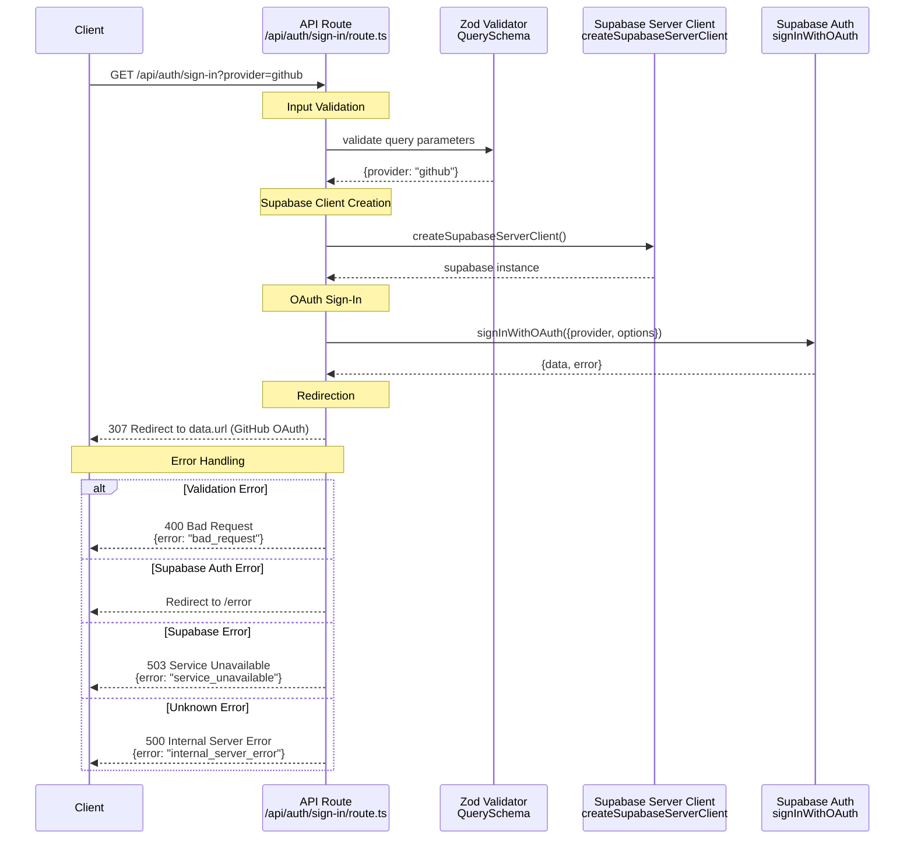

# Sign In Sequence Diagram

This sequence diagram shows the data flow for the `GET /api/auth/sign-in` endpoint, which initiates the OAuth sign-in flow with a provider like GitHub.

## Key Components

### 1. Input Validation

- **Zod Schema**: Validates the `provider` query parameter. Defaults to "github".
- **Error Handling**: Returns 400 on validation failure.

### 2. Supabase Client

- A server-side Supabase client is created for the request.

### 3. OAuth Flow Initiation

- **`signInWithOAuth`**: The route calls Supabase Auth to get a provider-specific OAuth URL.
- **`redirectTo`**: It specifies a callback URL (`/api/auth/callback`) for Supabase to redirect to after the user authenticates with the provider.

### 4. Redirection

- **Success**: The client's browser is redirected to the OAuth provider's authentication page.
- **Error**: If Supabase returns an error during the `signInWithOAuth` call, the user is redirected to a generic error page.
