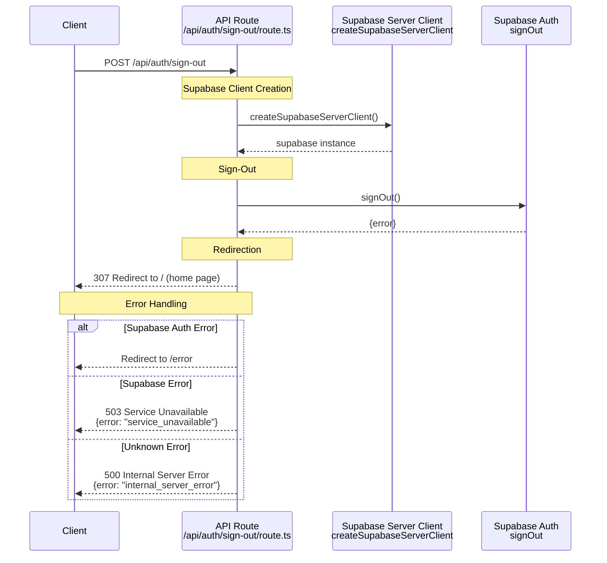

# Sign Out Sequence Diagram

This sequence diagram shows the data flow for the `POST /api/auth/sign-out` endpoint, which terminates the user's authentication session.

## Key Components

### 1. Request Method

- **POST**: Uses POST method for sign-out operations (standard practice for state-changing operations).
- **No Parameters**: Sign-out doesn't require any input validation or parameters.

### 2. Supabase Client

- A server-side Supabase client is created for the request.

### 3. Sign-Out Operation

- **`signOut`**: The route calls Supabase Auth to terminate the user's session.
- **Session Cleanup**: Supabase handles clearing authentication cookies and session data.

### 4. Redirection

- **Success**: The client's browser is redirected to the home page (`/`).
- **Error**: If Supabase returns an error during the `signOut` call, the user is redirected to a generic error page.

## Architectural Patterns

- **Simple Operation**: No validation or complex domain logic required.
- **Consistent Error Handling**: Follows the same error mapping patterns as other auth endpoints.
- **Session Management**: Relies on Supabase's built-in session cleanup mechanisms.
- **Redirect Strategy**: Uses redirects instead of JSON responses for better UX in browser contexts.
